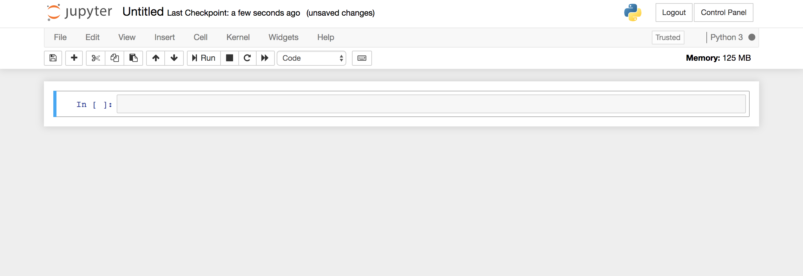

# Deep Learning Workshop


## Sessions

| Session | Key Topics | Additional Reading/Viewing | 
| -------  | --------------------------- | -------------------------- | 
| A Brief History of Neural Networks & Setup| Perceptrons, multilayer Perceptrons, neural networks, the rise of deep learning, getting your environment setup | [Goodfellow Deep Learning Chapter 1](https://www.deeplearningbook.org/contents/intro.html) [Ai: The Tumultuous History Of The Search For Artificial Intelligence](https://www.amazon.com/Ai-Tumultuous-History-Artificial-Intelligence/dp/0465029973/ref=sr_1_2?keywords=history+of+ai&qid=1566813741&s=books&sr=1-2) |
| Neural Networks Demystified|  The mechanics and mathematics for forward and backpropagation in neural networks. Overfitting + Regularization|  [Neural Networks Demystified YouTube Series](https://www.youtube.com/watch?v=bxe2T-V8XRs)|
| Introduction to Pytorch | Why Pytorch?, Pytorch as "Numpy with GPU Support", simple neural network in Pytorch, automatic differentiation, nn.Module, PyTorch layers, PyTorch Optim, nn.Sequential | [Great Torch Intro by Jeremy Howard](https://pytorch.org/tutorials/beginner/nn_tutorial.html) |
| Modern Deep Learning Practices|  Stochastic gradient descent, regression vs classification, one hot encoding, cost functions and maximum likelihood, cross entropy, CNNs, pooling and strides, AlexNet walkthrough, ImageNet, transfer learning, adaptive pooling, dropout, data augmentation, a little historical perspective | [Ian Goodfellow's Deep Learning - Chapter 1, Section 6.2, and Section 8.1](https://www.deeplearningbook.org/) |
| Get results fast with fastai | Jeremy Howard and the fastai philosophy, DataBunches, Learners, NLP with fastai, world class computer vision with fastai | [fastai course](https://github.com/fastai/course-v3)|
|  GANs | Ian Goodfellow invents GANs, the world's simplest GAN & nash equilibria, a dive into higher dimensions, DCGAN to the rescue, Visualizing GANs, GAN grow up (sortof), StyleGAN insanity, the unbelievably interesting world of GAN variants | |


### Viewing Notebooks
You will be able to view most notebooks directly in github. This works pretty well, except html won't render embedded slide shows unfortunately. The best way to view the notebooks is to clone this repo and run them yourself! Checkout the setup instructions below.

### Note on Launching the Jupyter Notebooks
To properly view the images and animations, please launch your jupyter notebook from the root directory of this repository. 

### Downloading Animations
An number of notebooks in the workshop use large animation files. To keep this repo (relaitvely) lightweight, we've stored these videos on a seperate server. They can be downloaded here [ADD LINK], and should be placed in a directory called videos/ in the top level of this repo. 


## Jupyter Hub
We've setup a Jupyter Hub instance for this workshop to allow GPU access, and provide access to a preconfigured environment. 

By connecting to Jupyter Hub, you will not need to setup up an environment. Go to this link (active during workshop): [Link to Jupyter Hub]().

At login, create your username and password:


Next, click **New** and select **Python 3**:


This will create a notebook for you to work in! 



Once you are logged in, please open a terminal (directly available in JupyterHub), and clone this respository. 


## Setting Up Your Environment Locally 

After cloning this repo to your local machine, you'll need to setup your Python environment and dependencies. The Python 3 [Anaconda Distribution](https://www.anaconda.com/download) is the easiest way to get going with the notebooks and code presented here. 

(Optional) You may want to create a virtual environment for this repository: 

~~~
conda create -n dl-workshop python=3
conda activate dl-workshop
~~~

You'll need to install the jupyter notebook to run the notebooks:

~~~
conda install jupyter

# You may also want to install nb_conda (Enables some nice things like change virtual environments within the notebook)
conda install nb_conda
~~~

### PyTorch and fastai
You should be able to install pytorch and fastai with the single command: 
```
conda install -c pytorch -c fastai fastai
```

If you run into issues, you may try to install fastai and pytorch via pip:
```
pip install torch torchvision
pip install fastai
```

This repository requires the installation of a few extra packages, you can install many of them all at once with:
~~~
pip install -r requirements.txt
~~~


### opencv
We'll occasionally use opencv, you can install with conda:
~~~
pip install opencv-python
~~~


(Optional) [jupyterthemes](https://github.com/dunovank/jupyter-themes) can be nice when presenting notebooks, as it offers some cleaner visual themes than the stock notebook, and makes it easy to adjust the default font size for code, markdown, etc. You can install with pip: 

~~~
pip install jupyterthemes
~~~

Recommend jupyter them for **presenting** these notebook (type into terminal before launching notebook):
~~~
jt -t grade3 -cellw=90% -fs=20 -tfs=20 -ofs=20 -dfs=20
~~~

Recommend jupyter them for **viewing** these notebook (type into terminal before launching notebook):
~~~
jt -t grade3 -cellw=90% -fs=14 -tfs=14 -ofs=14 -dfs=14
~~~

Jupyterthemes also includes some nice dark options: 
~~~
jt -t oceans16
~~~

Finally, you can reset to the standare notebook with: 
~~~
jt -r
~~~

